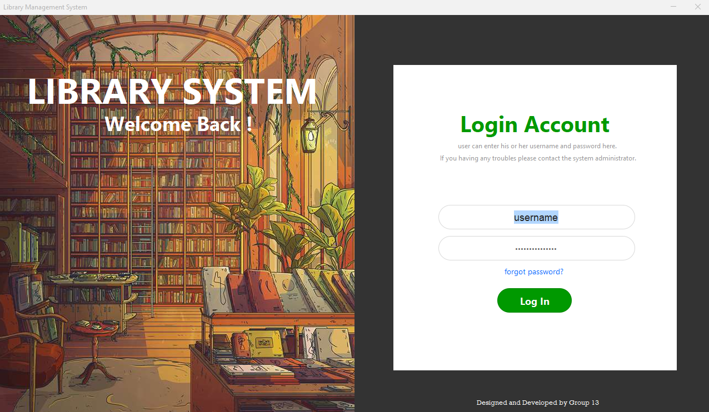
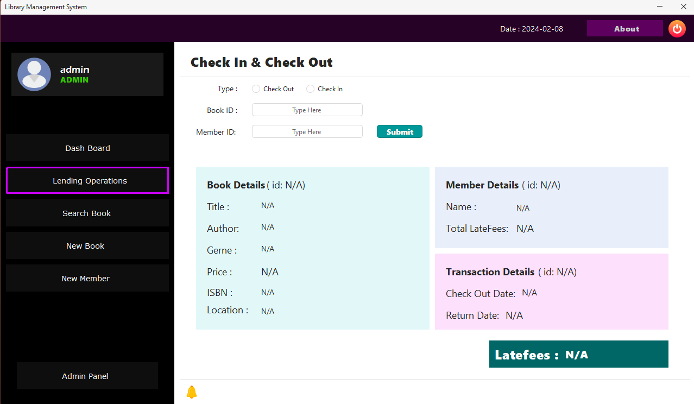
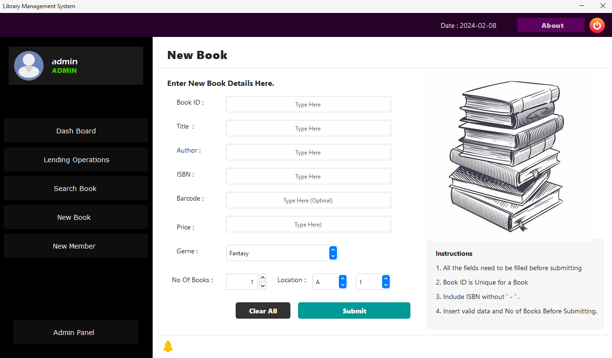
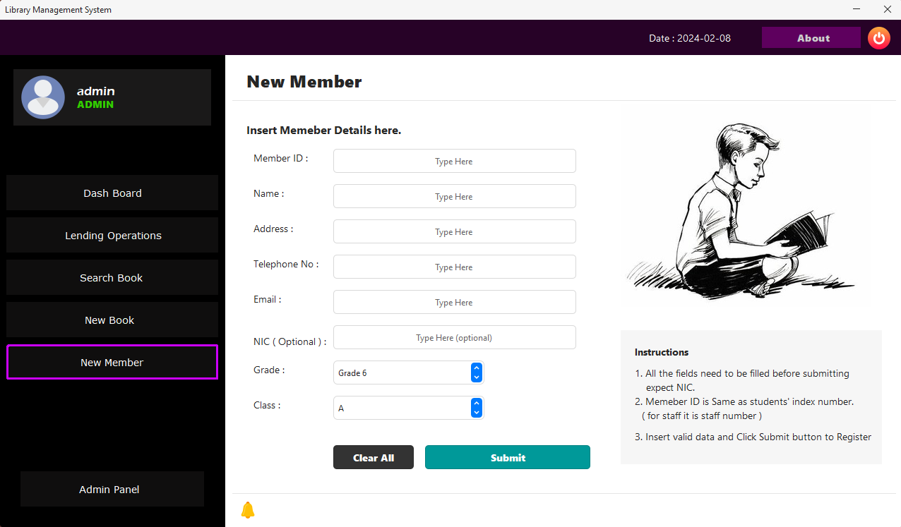
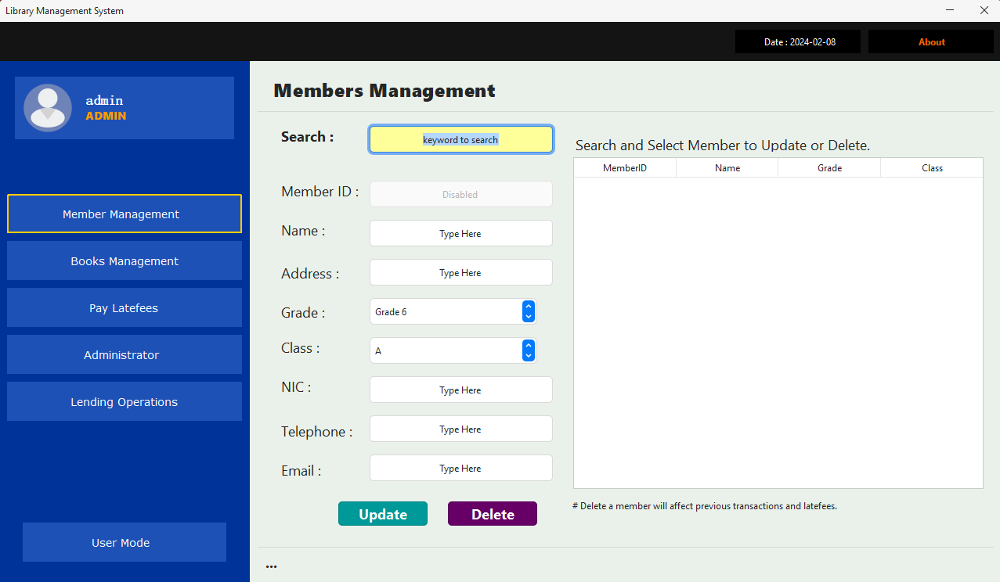

# Library Management System 📚

## Purpose 🎯
College Library Management System is designed to efficiently manage the library operations of Sri Premanda College. It facilitates tasks such as adding books, managing members, handling lending transactions, and more.

## Database Configuration ⚙️
### config.properties
The `config.properties` file is crucial for configuring the database connection. Make sure to update the following settings:

```properties
# Database connection details
url=jdbc:mysql://localhost:3306/LibDB
user=your_username
password=your_password

# Root user details for creating the database
rootUrl=jdbc:mysql://localhost:3306
rootUser=your_username
rootPassword=your_password

# Database name
dbName=LibDB
```

url: The URL for connecting to the MySQL database. Change the port number (e.g., localhost:3306) based on your MySQL server's configuration. Feel free to modify the configuration according to your MySQL database setup.

### Building the Database 🛠️
Run only the `LIB_PROJECT.java` Main Class to set up the SQL database. The database name is `LibDB`. Ensure that there is no existing database with this name before running.
Inside the Config Properties file, replace your MySQL server details and save it before running the `LIB_PROJECT.java` Main Class.
Feel free to modify this template to suit the specific details and structure of your project.
 
## Log In Information 🔐
- **Username:** admin
- **Password:** admin

## Additional Links 🌐
- [Report](REPORT.md)
- [Database](DATABASE.md)

## System Screenshots 📸
1. 
2. 
3. 
4. 
5. 